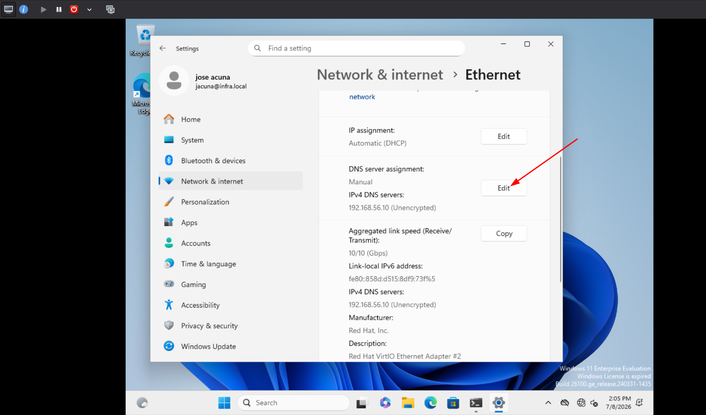
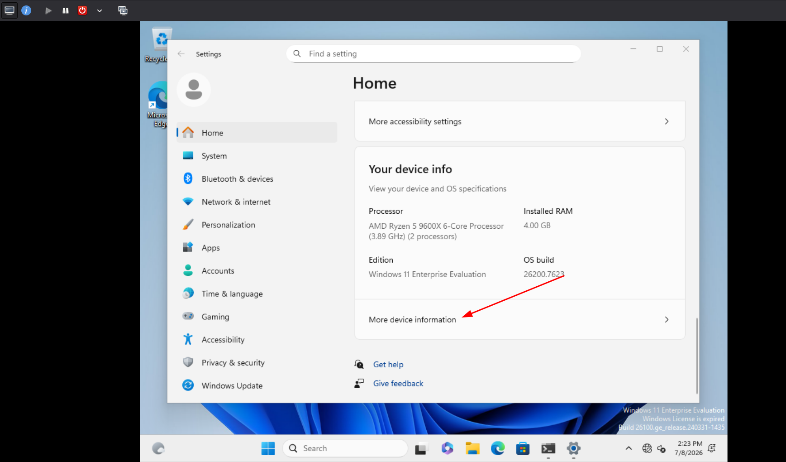
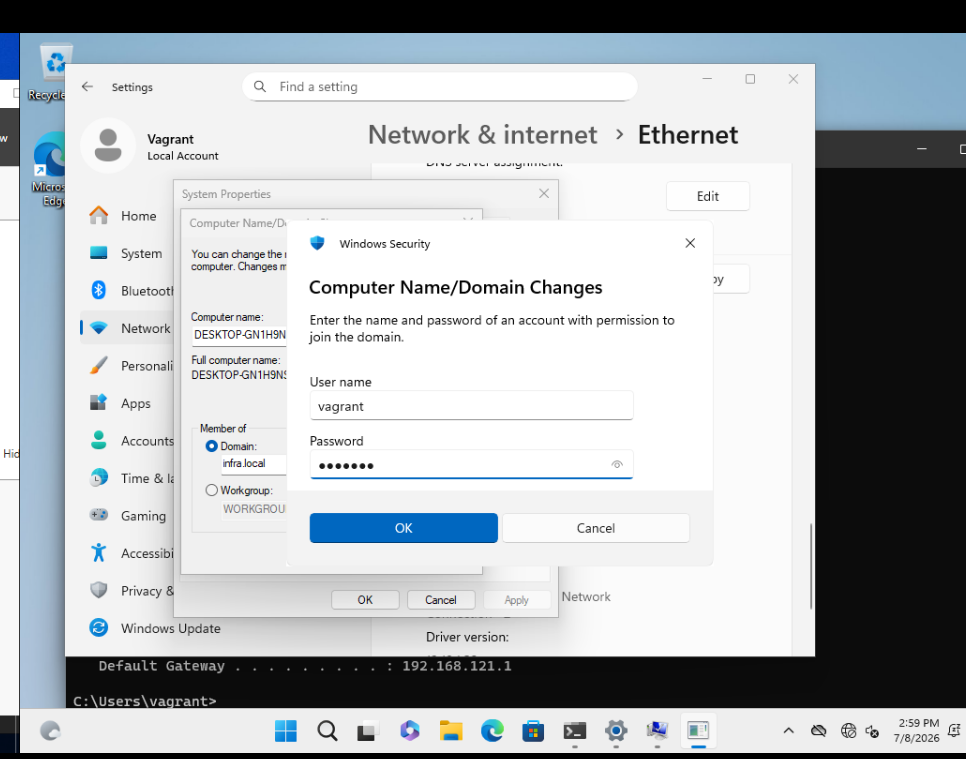
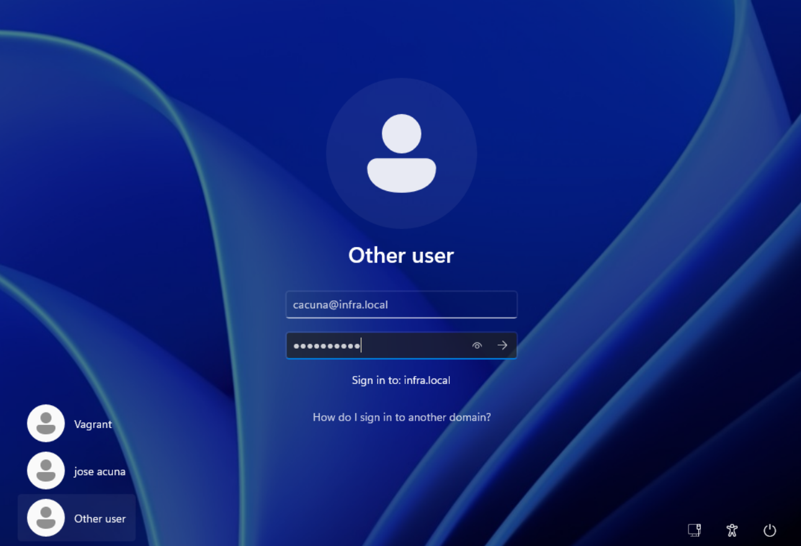
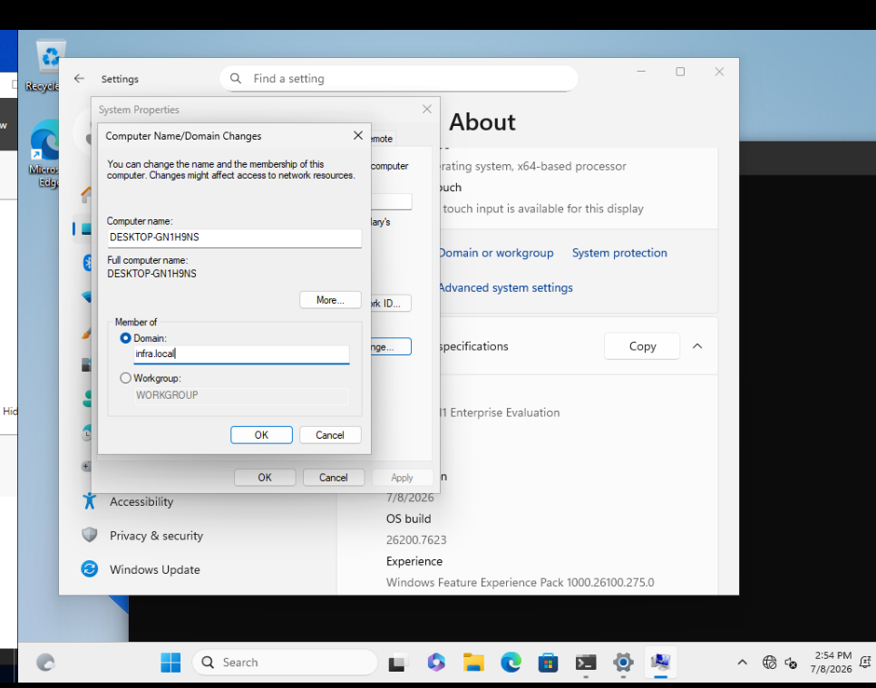
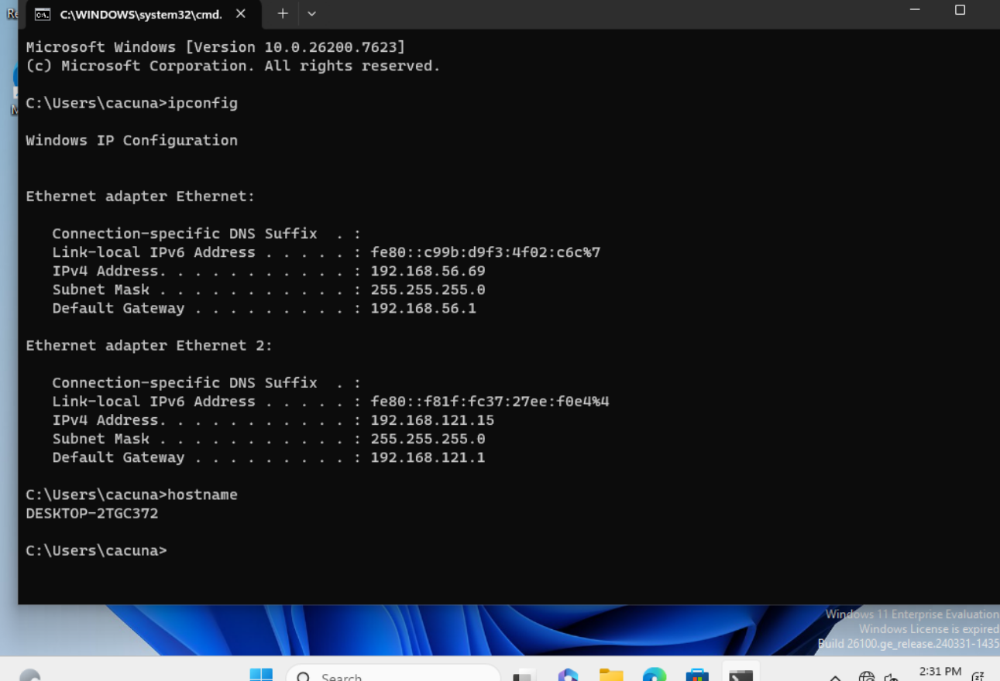

# Unir Windows 11 al Dominio

Guía para conectar el cliente Windows 11 al dominio `infra.local`.

---

## Prerrequisitos

- El DC debe estar encendido y accesible en `192.168.56.10`
- El win-client debe tener red en `infra-net` (DHCP)

## 1. Configurar DNS del cliente

El cliente debe usar el DC como servidor DNS para resolver el dominio.

Abre **Control Panel > Network and Sharing Center** o ejecuta desde PowerShell:

```powershell
# Identificar la interfaz conectada a infra-net
Get-NetAdapter | Where-Object {$_.Status -eq "Up"}

# Asignar DNS al DC
netsh interface ip set dns "Ethernet 2" static 192.168.56.10
```



## 2. Unir al dominio

Ve a **Settings > System > About** o haz clic derecho en **This PC > Properties**.
Selecciona **Rename this PC (Advanced)** o **Domain or Workgroup**.

- Elige **Domain** e ingresa: `infra.local`
- Credenciales del dominio: `INFRA\vagrant` o `INFRA\Administrator`



## 3. Autenticación

Usa las credenciales del administrador del dominio:

| Campo       | Valor                |
|-------------|----------------------|
| Usuario     | vagrant              |
| Contraseña | vagrant               |
| Dominio     | infra.local          |



Se mostrará un mensaje de bienvenida. Es necesario reiniciar el equipo.



## 4. Iniciar sesión con usuario del dominio

En la pantalla de inicio de sesión, selecciona **Other user (Otro usuario)** y usa:

```
INFRA\cristian
!@Infra123!
```



## 5. Verificar

Abre **Settings > Accounts > Access work or school** y confirma que aparece `Connected to INFRA.local`.

