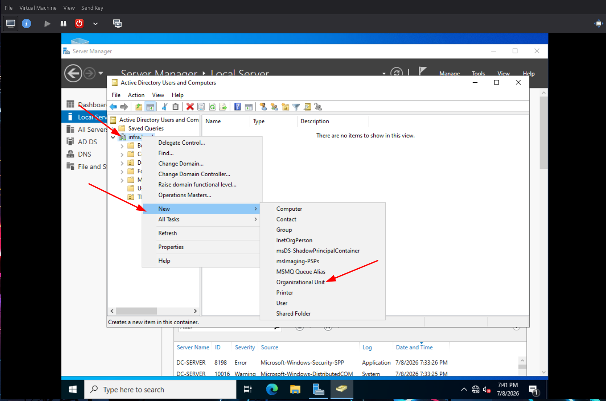
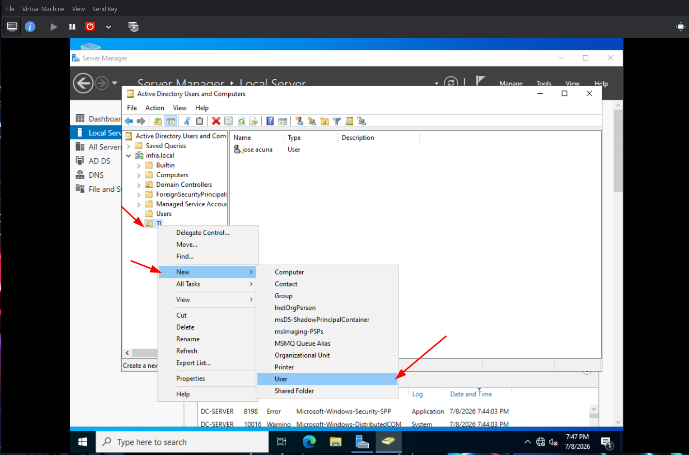
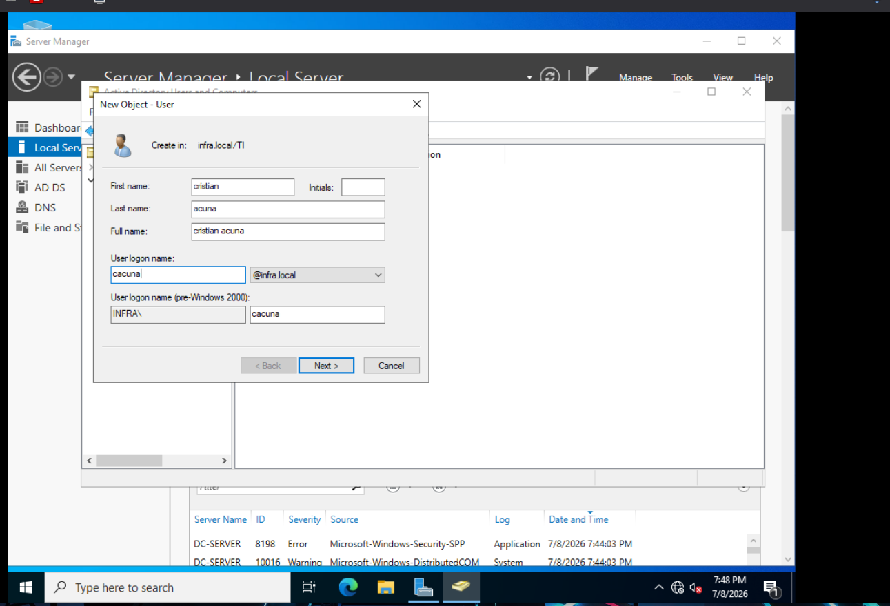
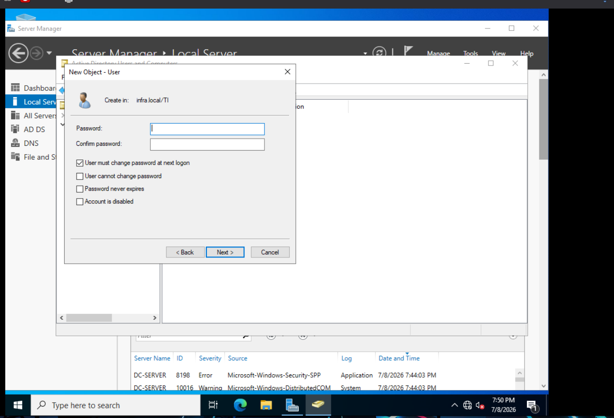
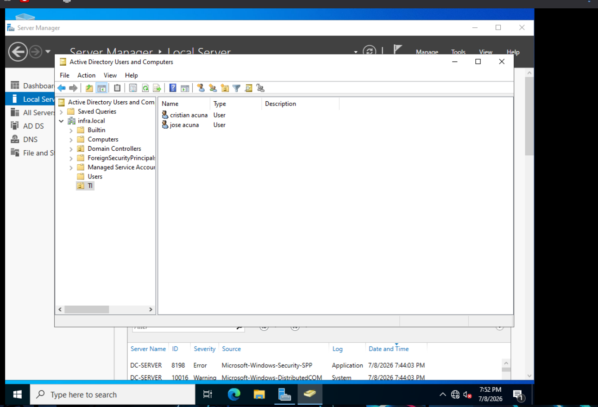

# Creación de Unidades Organizativas (OU) y Usuarios

Guía para estructurar el directorio activo con departamentos y usuarios.

---

## 1. Crear una Unidad Organizativa

Desde **Active Directory Users and Computers** (`dsa.msc`):

1. Haz clic derecho sobre el dominio `infra.local`
2. Selecciona **New > Organizational Unit**
3. Ingresa el nombre del departamento (ej. `TI`)



## 2. Crear usuarios dentro de la OU

Selecciona la OU (ej. **TI**) y haz clic derecho > **New > User**.



Configura los datos del usuario:

| Campo     | Ejemplo           |
|-----------|-------------------|
| Full name | Cristian Acuna    |
| User logon| cacuna            |



## 3. Contraseña

Establece una contraseña temporal (el usuario la cambiará al iniciar sesión):

```
!@Infra123
```

Marca **User must change password at next logon** (recomendado para entornos reales).



## 4. Ver usuarios del departamento

Cada usuario creado dentro de la OU **TI** aparecerá listado en el panel derecho. Puedes repetir el proceso para agregar más.



---

### Sugerencia de estructura

```
infra.local
├── Builtin
├── Computers
├── Domain Controllers
├── TI                    ← OU
│   ├── cristian
│   ├── maria
│   └── juan
├── Contabilidad           ← OU
├── RH                     ← OU
└── ...
```