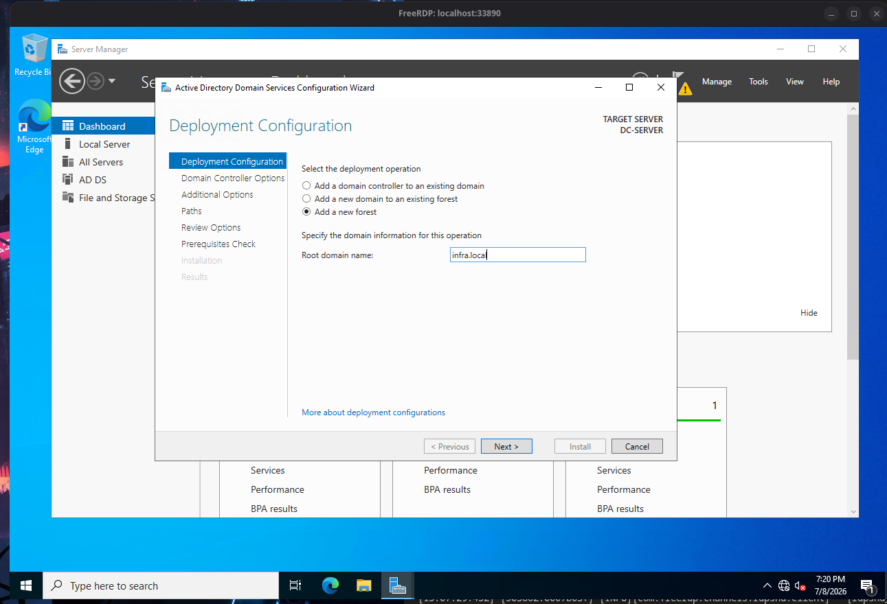
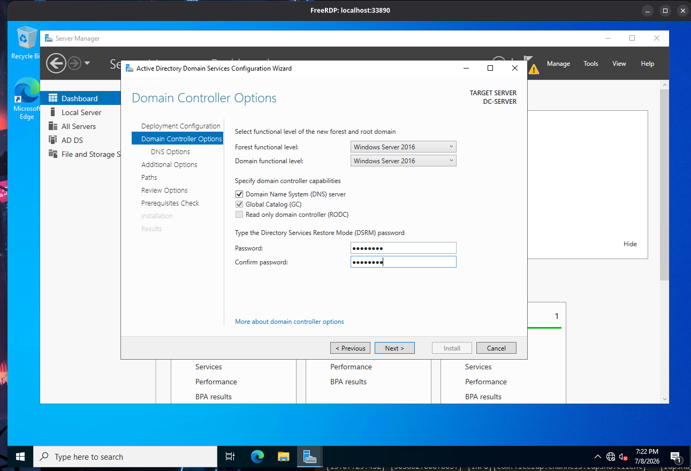
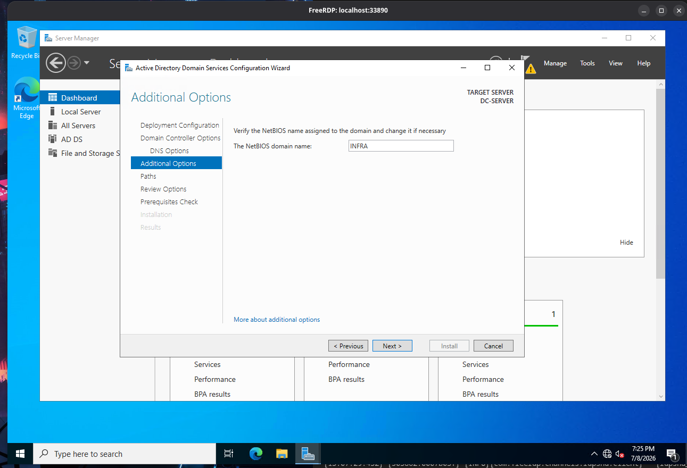
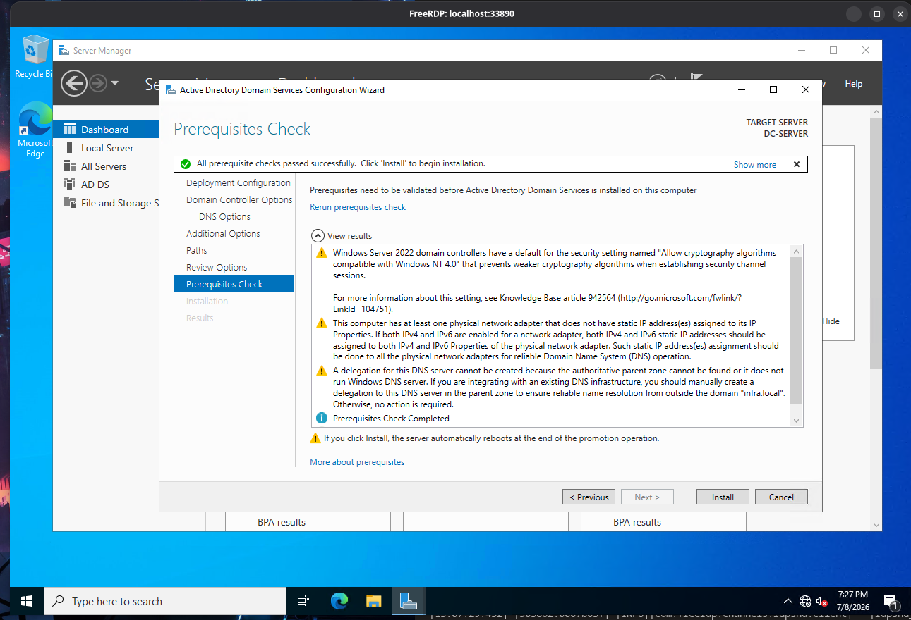
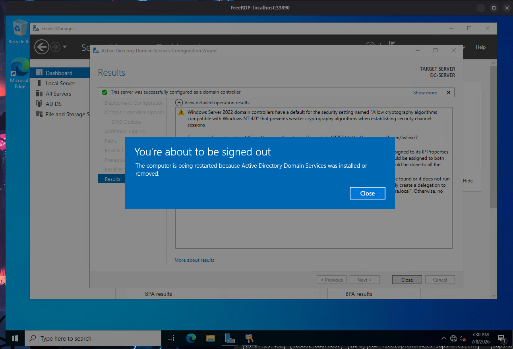
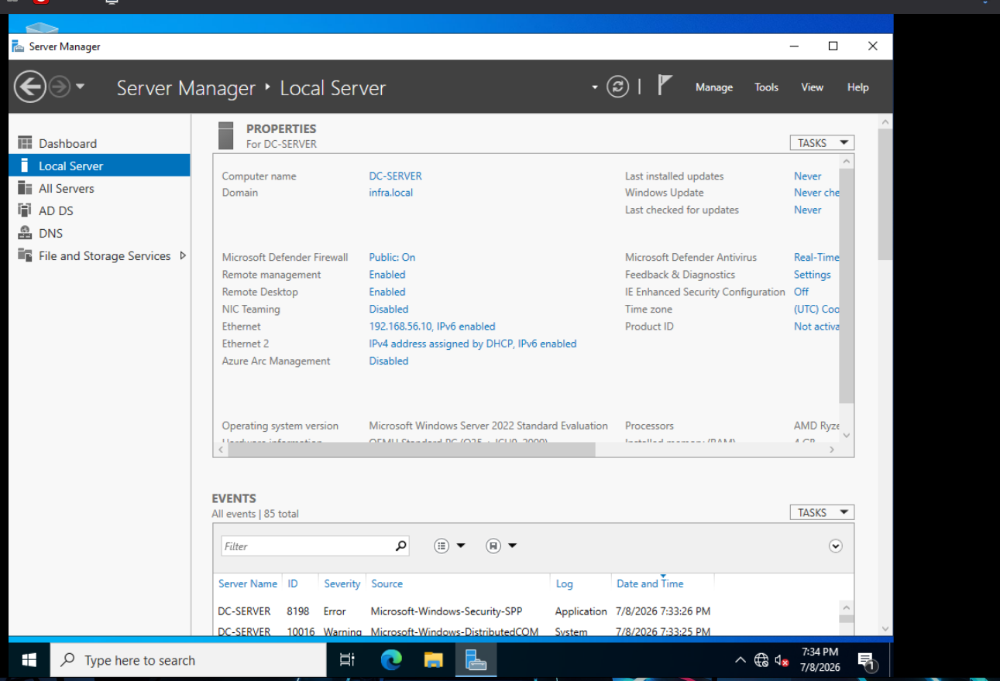

# Configuración del Dominio en Windows Server 2022

Guía paso a paso para promocionar el servidor a Domain Controller desde Server Manager.

---

### 1. Abrir Server Manager

Al iniciar sesión en el DC (`vagrant` / `vagrant`), Server Manager se abre automáticamente.

### 2. Agregar el rol de Active Directory

Haz clic en **Manage > Add Roles and Features** y avanza hasta **Server Roles**.
Selecciona **Active Directory Domain Services** y acepta los componentes adicionales.



### 3. Promocionar a Domain Controller

Una vez instalado el rol, aparecerá un ícono de advertencia amarillo.
Haz clic en **Promote this server to a domain controller**.



### 4. Crear un nuevo bosque

Selecciona **Add a new forest** e ingresa el nombre del dominio:

```
infra.local
```



### 5. Configurar credenciales DSRM

Establece la contraseña del modo de recuperación de servicios de directorio:

```
P@ssword123!
```


### 6. Opciones de DNS

Deja los valores predeterminados. No es necesario configurar delegación DNS.


### 7. Revisión final

Verifica que todos los requisitos se cumplan. Si aparece una advertencia sobre la delegación DNS, se puede ignorar.



### 8. Instalar

Haz clic en **Install**. El servidor se reiniciará automáticamente al finalizar.



### 9. Verificar el dominio

Tras el reinicio, inicia sesión con `INFRA\Administrator` o `vagrant` (la cuenta local se convierte en administradora del dominio automáticamente).

Abre **Active Directory Users and Computers** desde **Tools** en Server Manager para ver el dominio creado.

